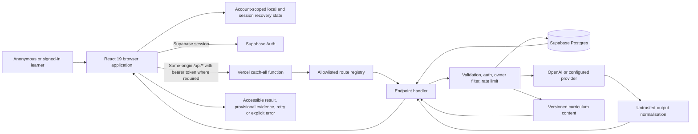

# VertexED architecture

**Snapshot:** 2026-09-20, checkout `b009c9ab` plus preserved working-tree changes

This document maps the deployed product boundary. Historical research and unrelated portfolio repositories are excluded by `VERTEXED_REPO_ISOLATION.md`.

## Runtime topology



## Technology and build

| Layer | Implementation |
|---|---|
| Client | React 19.2.7, React Router 7.18.2, Vite 7.3.6, TypeScript 5.8, Tailwind/Radix and product CSS. |
| Server | Node-compatible Vercel Serverless Function at `api/[[...path]].js`; route dispatch in `api/_lib/routes.js`. |
| Identity/data | Supabase JS 2.x, Supabase Auth, Postgres migrations and RLS. |
| AI | OpenAI SDK plus provider adapters, bounded requests, output validators and deterministic fallbacks for defined features. |
| Documents | `docx`, PDF parsing/export support, sanitised markdown and KaTeX rendering. |
| Observability | Fixed-schema first-party telemetry, Vercel Analytics and Speed Insights loaded after interaction. |
| Test/build | Node test runner, ESLint, TypeScript, Playwright, content provenance scripts, bundle budgets, Supabase CLI database contracts. |
| Deployment | Vercel static output plus one catch-all function; GitHub Actions run source-bound build, browser and database jobs. |

Required toolchain is Node `>=22.22.0 <23` and npm `10.9.8` according to `package.json`. The workflow pins Node 22.22.0 but currently relies on the npm bundled with that Node distribution.

## Client boundaries

`src/app/App.tsx` is the route composition root. Route modules are lazy loaded. `SiteLayout` provides public navigation and shared metadata. `AuthProvider` hydrates the Supabase session. `ProtectedRoute` controls authenticated navigation and checks account/waitlist state. `AdminRoute` adds the browser-side admin experience, while the admin API separately enforces the role.

### Public surfaces

- Landing, features, product/brand, about, privacy and terms.
- Login, signup, waitlist pending and auth callback.
- Resource articles, curriculum-tool index, MYP hub/subjects/eAssessment.
- Study-guide and archive surfaces. Unapproved study guides are omitted from the generated sitemap.

### Protected learner surfaces

- Dashboard/main workspace and onboarding.
- Exam preparation and MYP practice.
- Notetaker/quiz and study notebook.
- Resource library and study zone.
- AI chat, planner, answer reviewer and paper maker.
- User settings, export and account deletion.

### Admin surface

- `/admin/waitlist`, wrapped by `AdminRoute` and backed by the independently protected `waitlist-admin` endpoint.

### Client state

- Supabase owns identity and persistent cloud sessions.
- Cloud artefacts use `user_study_artifacts`; adaptive state uses `learner_state_items`; profile/curriculum choices use `profiles`.
- Device fallback keys are account scoped. Corrupt JSON is retained for recovery rather than silently converted to empty state.
- Planner and notebook reconciliation compare the revision actually read and expose local-only, pending, conflict and cloud-synced states.
- IndexedDB durable outbox code supports bounded retry of eligible state without blocking the foreground action.

## Server boundary

All deployed endpoints enter through `api/[[...path]].js`. The catch-all applies request identity, origin and security behaviour before `api/_lib/routes.js` resolves one of 22 routes. The registry owns method allowlists, raw-body selection and size limits. JSON parsing rejects malformed bodies and requests over the route limit.

| Endpoint | Methods | Auth expectation | Purpose |
|---|---|---|---|
| `health` | GET, HEAD | Public; readiness can require a protected token in production | Liveness, source identity and dependency readiness. |
| `telemetry` | POST | Public, IP-rate-limited | Persist bounded operational events without identity/free text. |
| `admin-status` | GET, HEAD | Authenticated | Report whether the verified identity has admin access. |
| `account` | DELETE | Authenticated | Revoke/delete the current account. |
| `account-export` | GET | Authenticated | Export current-account cloud state within hard caps. |
| `waitlist` | POST | Public, durable rate limit | Create/update a private-beta request. |
| `waitlist-status` | GET | Authenticated | Resolve the verified account's beta state. |
| `signup-invite` | POST | Public token flow with validation/rate limits | Create an invited Auth account and finalise membership. |
| `waitlist-admin` | POST | Authenticated admin | Manage waitlist decisions. |
| `study-guide-chat` | POST | Authenticated | Grounded assistant over approved/available guide context. |
| `ask` | POST | Authenticated | Routed AI study question. |
| `agents` | GET | Authenticated | Return bounded agent/directory state. |
| `quiz` | POST | Authenticated | Generate validated retrieval/practice material. |
| `note` | POST | Authenticated | Generate/transform validated notes. |
| `planner` | POST | Authenticated | Generate a bounded study plan. |
| `paper-generator` | POST | Authenticated | Generate a structured practice paper. |
| `review` | POST | Authenticated | Review text/image input with evidence-bound grading output. |
| `user-content` | GET, POST, PUT, PATCH, DELETE | Authenticated | Owner-scoped artefact CRUD and singleton replacement. |
| `learner-state` | GET, POST | Authenticated | Owner-scoped weakness, retry, draft and exam-session state. |
| `transcribe` | POST raw body | Authenticated | Bounded audio transcription. |
| `notebook` | POST | Authenticated | Generate validated notebook material. |
| `board-resource` | POST | Authenticated | Produce a board/curriculum resource response. |

The default JSON limit comes from `api/_lib/auth.js`; `review` permits 6 MiB, learner state 1 MiB, user content 512 KiB, and telemetry 8 KiB. Upload-like paths are bounded in their handlers and are not exposed as general public storage.

## Trust boundaries

1. **Browser input is untrusted.** Client IDs, roles, scores and ownership are never authoritative.
2. **Navigation guards are user experience, not authorization.** Each privileged API verifies a bearer token.
3. **Service-role access requires an owner predicate.** The service key bypasses RLS, so handlers derive `user_id` from the verified token and filter every relevant operation.
4. **RLS protects direct data access.** Migrations enable policies on account-owned tables and restrict service operations to explicit grants/RPCs.
5. **AI output is untrusted.** Structured responses are parsed and bounded. Review evidence must cite exact spans from the submitted answer. Unsupported scores remain provisional.
6. **Content is not approved by existence.** Provenance generation records inventory and review flags; the sitemap includes only editorially approved guides.
7. **Build identity is fail closed.** Production builds require a revision and health responses expose source identity for release comparison.
8. **Operational telemetry excludes learner content.** The schema accepts categories, route paths without query strings, duration, outcome and fixed feedback enums.

## Data model

### Identity and access

- Supabase Auth supplies users and sessions.
- `profiles.id` is tied to `auth.users.id` and stores curriculum/onboarding state.
- Waitlist rows represent beta access and invite lifecycle. Server-side functions handle atomic claim/finalisation paths.

### Learner artefacts

`user_study_artifacts` stores an owner, kind, bounded title, JSON payload, optional owner-scoped idempotency key and timestamps. Supported kinds are `note`, `review`, `paper`, `planner` and `notebook`. The shared runtime contract, database constraint, API validation and client routing must change together.

Creation reuses an idempotency key for safe retries. Identical replays return the existing row; a key reused with different content returns a conflict. Planner/notebook singleton replacement uses a conditional update rather than delete-before-insert.

### Learner state

`learner_state_items` stores typed weakness, retry, mock-draft, exam-session and related adaptive records. Server code batches/synchronises state through bounded queries/RPCs. Only teacher, official-mark-scheme or validated deterministic confirmation can promote evidence to measured status.

### Observability and rate limits

Database-backed rate-limit and observability tables provide durable serverless coordination. Production rate limiting fails closed with 503 when the durable store is unavailable; in-memory fallback is limited to non-production/test contexts.

## Major workflow maps

### 1. Landing to waitlist

```text
Anonymous learner
  -> / or /signup
  -> client form validation
  -> POST /api/waitlist
  -> origin/body/rate-limit checks
  -> normalise email and request fields
  -> service-role waitlist upsert
  -> explicit pending/already-requested/error UI
```

### 2. Invite, authentication and onboarding

```text
Approved invite
  -> POST /api/signup-invite with bounded token/input
  -> rate limit and atomic invite validation
  -> Supabase Auth admin creates user
  -> waitlist membership is finalised/linked
  -> login or auth callback establishes session
  -> /api/waitlist-status verifies account eligibility
  -> ProtectedRoute permits onboarding/main
  -> profile/curriculum state persists under the verified user
```

### 3. Returning learner to saved work

```text
Session hydration
  -> authenticated route guard
  -> dashboard reads account-scoped local state and cloud state
  -> conflict/revision rules choose or pause reconciliation
  -> unfinished work, due retries and measured evidence render
  -> user resumes the originating tool
```

### 4. AI study action

```text
Learner input
  -> client validation and request deadline
  -> authFetch with refreshed bearer retry where allowed
  -> authenticated, rate-limited endpoint
  -> bounded provider request with total timeout
  -> parse and validate untrusted output
  -> deterministic fallback or explicit 4xx/5xx on failure
  -> learner-visible result plus fixed-field telemetry
  -> optional owner-scoped save with idempotency/conflict status
```

### 5. Evidence-linked answer review

```text
Answer/text/image
  -> bounded review request
  -> provider vision/text analysis
  -> structural validation and exact-span verification
  -> PROVISIONAL when evidence is absent/invalid
  -> EVIDENCE_LINKED when spans are copied from the answer
  -> MEASURED only after an authorised confirmation source
  -> weakness/retry state and saved review artefact
```

### 6. Account export and deletion

```text
Authenticated settings action
  -> bearer verification
  -> export: bounded pagination of owned cloud rows + allowlisted current-account device keys
  -> delete: revoke refresh sessions, delete Auth identity, cascade linked learner data
  -> clear current-account browser state
  -> explicit completion or recoverable failure UI
```

### 7. Admin waitlist operation

```text
Admin browser route
  -> AdminRoute status check
  -> POST /api/waitlist-admin
  -> bearer verification + server-side requireAdmin
  -> durable per-user rate limit
  -> bounded waitlist query or mutation
  -> audit-safe response without exposing credentials
```

## Caching and delivery

- Hashed assets receive one-year immutable cache headers.
- API responses receive `no-store` and `X-Robots-Tag: noindex, nofollow`.
- `robots.txt` and `sitemap.xml` receive one-hour public caching.
- SPA routes rewrite to `index.html`; API and static asset paths are excluded.
- The legacy Vercel host and apex domain redirect to `https://www.vertexed.app` when transport works.
- Client route chunks, markdown, PDF, charts and marketing CSS are code split. Optional analytics loads four seconds after window load.

## SEO and public content

`react-helmet-async` provides canonical, robots, Open Graph, Twitter and structured-data metadata. The generated sitemap contains 87 public URLs in the audited build, including 48 curriculum-tool URLs and 0 unapproved guide URLs. `robots.txt` and social-preview assets are committed. Actual crawl/index status is external and was not verified while the custom domain was unavailable.

## Deployment and CI

`vercel.json` builds `dist`, configures the catch-all function, headers, rewrites, immutable assets and canonical redirects. GitHub Actions bind work to the exact source SHA and separate four responsibilities:

1. canonical lint/type/test/eval/build/bundle gate;
2. local keyboard/accessibility browser suite;
3. isolated Supabase migration and database-contract replay;
4. authenticated golden and production-browser certification.

The architecture is designed to prevent a green source build from being treated as production proof. `/api/health?readiness=1`, exact-revision comparison and production browser journeys remain separate release gates.

## Environment and external services

Variable names and ownership rules are documented in `docs/ENVIRONMENT_MATRIX.md` and `.env.example`. Secret values are not part of this architecture document. The principal external dependencies are Vercel, Supabase Auth/Postgres, the configured AI provider, DNS/TLS, analytics, and outbound email/OAuth settings.

## Current architectural limits

- The fallback production deployment is degraded and the custom domain is unreachable before HTTP.
- The database migrations/RLS suite was not executed locally in this audit because the container runtime stopped during Supabase initialisation.
- The current checkout is not an exact release candidate.
- Live provider quality, quota and cost behaviour were not exercised.
- Remote backup/restore, SMTP, OAuth, alert delivery and database network restrictions remain environment-owned evidence.
