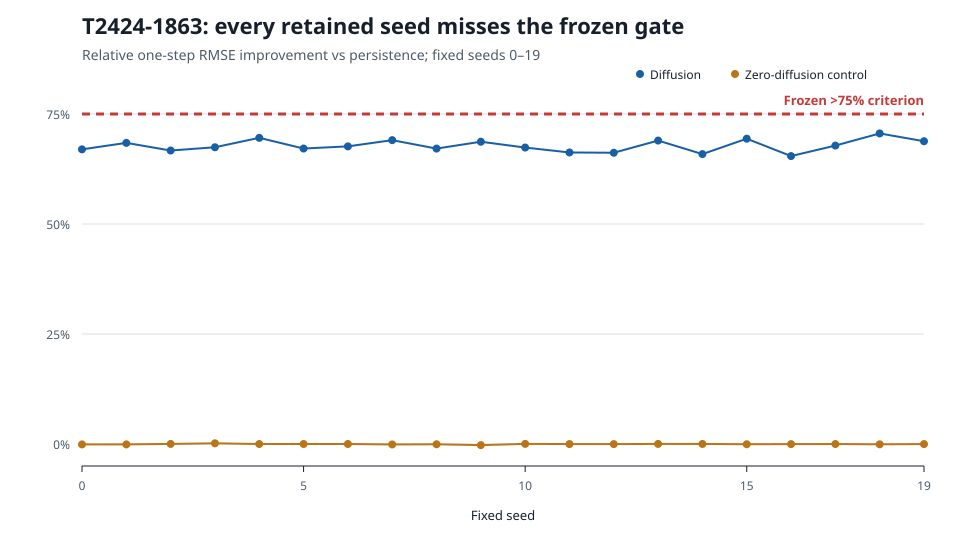

# A Reproducible Negative Screen for a Resource-Bounded Local Diffusion Operator

## Abstract

We evaluate a deliberately small local forecasting operator on a synthetic one-dimensional diffusion task under a frozen, falsifiable effect-size criterion. The retained source package predeclares the primary >75% improvement hypothesis across **10 deterministic seeds**. Exact-source reevaluation of seeds `0..9` gives mean learned coefficient `0.1795075`, mean persistence RMSE `0.0156492`, mean local-operator RMSE `0.00502198`, and mean relative improvement `67.8819%` (range `66.7000%–69.5857%`), below the predeclared requirement of greater than 75%. The primary hypothesis therefore failed. The repository also retains an expanded 20-seed execution/reproduction with mean relative improvement `67.7766%`; it independently preserves the same negative verdict. A zero-diffusion control shows no material gain in either accounting. Exact-head repository reproduction preserved the failed gate without changing the scientific source, threshold, baseline, or benchmark. These results support only a narrow conclusion: a resource-bounded local stencil can recover planted diffusion structure in this synthetic setting, while the tested effect-size hypothesis is not supported. We make no claim of neural-operator superiority, real-PDE generalization, or long-horizon forecasting performance.

## 1. Motivation and scope

Learned operators for partial differential equations are often evaluated as function-to-function models with substantially greater capacity than the scalar local update studied here. Fourier Neural Operator (FNO), DeepONet, and physics-informed neural operators such as PINO provide important reference families for future matched comparisons. This study does **not** compare against those models and therefore cannot support a superiority claim. Its narrower purpose is methodological: test a cheap local-physics hypothesis under an explicit rejection threshold, retain the negative result when that threshold is missed, and verify that the result is reproducible from the repository.

The experiment asks whether a three-point local diffusion update can both recover a planted scalar coefficient and improve held-out one-step RMSE by more than 75% relative to persistence while showing no material benefit when the planted diffusion coefficient is zero.

## 2. Frozen hypothesis and provenance accounting

The frozen primary hypothesis was:

> A learned scalar three-point diffusion operator will improve mean held-out one-step RMSE by more than 75% relative to persistence while recovering the planted coefficient near `0.18`; under zero diffusion, it will learn a coefficient near zero and show no material improvement.

The >75% threshold is the primary falsifier. It was not relaxed after observing outcomes.

The retained source package contains a seed-count documentation split that must be preserved rather than silently normalized. The README states the predeclared hypothesis across **10 deterministic seeds**. Separately, the recorded benchmark command/default, retained experiment metadata, later PR evidence, and exact-head reproduction execute **20 deterministic seeds**. Accordingly, this manuscript treats seeds `0..9` as the literal primary preregistered test and the 20-seed run as an expanded retained execution/reproduction. Both are negative under the same >75% gate. Historical source files are left unchanged.

## 3. Method

### 3.1 Synthetic dynamics

The benchmark generates one-dimensional states on a 32-point grid according to the local update

`u[t+1,i] = u[t,i] + alpha * (u[t,i-1] - 2u[t,i] + u[t,i+1]) + noise`,

with planted diffusion coefficient `alpha = 0.18` for the main condition. Gaussian noise has standard deviation `0.005`. Each deterministic seed contains 140 samples and uses the frozen 70/30 train/evaluation split recorded by the benchmark metadata.

### 3.2 Proposed operator

The proposed method is intentionally simple: one scalar diffusion coefficient is estimated from training transitions by least squares and used with a three-point local stencil. It is not a neural operator and contains no learned global grid-to-grid mapping.

### 3.3 Baseline and control

The matched baseline is persistence: the next state is predicted as the current state. The negative control sets the planted diffusion coefficient to zero while retaining the same evaluation machinery. This control tests whether the local fitting procedure appears to create an artificial forecasting gain when diffusion is absent.

### 3.4 Seeds, metric, and uncertainty

The primary preregistered test is evaluated on deterministic seeds `0..9`. The retained expanded execution/reproduction evaluates seeds `0..19`. The primary metric is mean held-out RMSE relative improvement versus persistence. Reported ranges and sample standard deviations are descriptive summaries across deterministic trials; no population-level significance claim is made.

### 3.5 Reproducibility environment

The scientific source is commit `7cee0bd4d5cc7a3ac497476d322c6f0e16da9ee6`. A hosted replay used Ubuntu 24.04.4 LTS, Python 3.11.15, pip 26.2.1, pytest 9.1.1, and CPU execution. The repository records `python -m pip install -e .`, `pytest -q`, and `python -m local_diffusion_operator.benchmark --seeds 20`; machine-readable per-seed output is emitted by the same benchmark with `--json`. The 10-seed primary values below are the deterministic seeds `0..9` evaluated from the exact retained source, not a tuned or reselected subset.

## 4. Results

### 4.1 Primary preregistered 10-seed test

| Metric | Mean | n |
|---|---:|---:|
| learned diffusion coefficient | 0.1795075359 | 10 |
| persistence RMSE | 0.0156491640 | 10 |
| local-operator RMSE | 0.0050219824 | 10 |
| relative improvement | 67.8818787% | 10 |
| zero-diffusion relative improvement | -0.0428507% | 10 |

The primary relative-improvement range is `66.6999821%–69.5856939%`. The mean and every retained primary seed are below the frozen >75% threshold. The preregistered hypothesis therefore fails.

### 4.2 Expanded retained 20-seed execution/reproduction

| Metric | Mean | Sample SD | n |
|---|---:|---:|---:|
| learned diffusion coefficient | 0.1796886 | 0.0013562 | 20 |
| persistence RMSE | 0.0156105 | 0.0005888 | 20 |
| local-operator RMSE | 0.00502318 | 0.00008758 | 20 |
| relative improvement | 67.7766% | 1.3748 percentage points | 20 |
| zero-diffusion learned coefficient | -0.0003114 | 0.0013562 | 20 |
| zero-diffusion relative improvement | -0.0289% | 0.0789 percentage points | 20 |

The expanded relative-improvement range is `65.4364%–70.5814%`. This larger retained execution independently preserves the same negative verdict. It is corroborating reproduction evidence, not a replacement for the literal 10-seed preregistration.

**Figure 1.** Relative one-step RMSE improvement versus persistence for every fixed seed in the retained 20-seed execution. All diffusion seeds remain below the frozen >75% criterion; the zero-diffusion control remains near zero. The figure is generated deterministically from committed `raw_metrics.json` and does not change the primary 10-seed or expanded 20-seed negative verdict.

The learned coefficient closely tracks the planted value and the local operator reduces one-step RMSE relative to persistence in both accountings. These are secondary observations and do not override the failed primary criterion.

## 5. Failure analysis

The experiment fails scientifically because the measured effect size is consistently below the preregistered threshold, not because of a repository or execution failure. Exact-head reproduction subsequently succeeded while preserving the same negative verdict. Infrastructure verification establishes that the failed result is executable and reproducible; it does not convert the scientific outcome into a pass.

The retained evidence does not identify a single causal reason for the shortfall. Plausible contributors include observation noise, the deliberately restricted scalar coefficient, one-step evaluation, and the strength of persistence on locally smooth trajectories. These are hypotheses for successor studies, not post-hoc explanations established by the current experiment.

## 6. Related-work boundary

Three verified operator-learning references define comparator families that would be necessary for a stronger successor study:

1. Z. Li et al., *Fourier Neural Operator for Parametric Partial Differential Equations*, arXiv:2010.08895.
2. L. Lu, P. Jin, and G. E. Karniadakis, *DeepONet: Learning nonlinear operators for identifying differential equations based on the universal approximation theorem of operators*, arXiv:1910.03193.
3. Z. Li et al., *Physics-Informed Neural Operator for Learning Partial Differential Equations*, arXiv:2111.03794.

These works are cited only to establish relevant comparator families. Because the present study does not execute matched FNO, DeepONet, or PINO baselines, it makes no comparative performance claim against them.

## 7. Limitations

The evidence is restricted to synthetic one-step scalar diffusion on a 32-point grid. The proposed method is a fitted scalar local stencil rather than a neural operator. There is no real or public PDE dataset, long rollout, distribution shift, mesh-resolution study, matched FNO/DeepONet/PINO comparison, comprehensive runtime or peak-memory benchmark, or statistical inference beyond descriptive deterministic-seed summaries. The experiment therefore cannot establish general operator-learning performance or external scientific validity.

The retained documentation contains a genuine 10-versus-20-seed provenance split. This paper does not erase that history: the literal 10-seed preregistered test is reported as primary, while the 20-seed run is reported as expanded execution/reproduction. Both fail the same frozen threshold, so the provenance correction changes release accounting but not the scientific verdict.

## 8. Data and code availability

The experiment uses generated synthetic states and therefore requires no external dataset download. Source, tests, frozen metadata, reproduction instructions, and summarized results are retained in `portfolio/new-projects/t2424-1863-local-diffusion-operator/`. A release should point to an immutable repository commit or archival DOI rather than only a moving branch. Exact-head 20-seed per-seed and uncertainty outputs are retained under `paper/evidence/` with workflow, source, archive, and file digests in `EVIDENCE_MANIFEST.json`. The 10-seed primary values remain the literal `0..9` subset accounting described above.

## 9. Reproducibility statement

The original hosted reproduction reports four passing tests and retained environment metadata. A later exact-head verification on PR #302 reran the unchanged frozen 20-seed benchmark and canonical repository CI against head `147ce38bf2d965a4b14fa31844856153e6e18f7b`, preserving the negative gate. Paper-head workflow `33273832236` retained the exact 20-seed raw and reporting-only uncertainty outputs as artifact `9720891119`; those files and their SHA-256 provenance are now committed under `paper/evidence/`. The exact-source 10-seed calculation uses the deterministic preregistered seeds `0..9` from the same source and benchmark logic. No threshold, baseline, benchmark task, or scientific source was rescue-tuned to obtain a passing scientific outcome.

## 10. Conclusion

A compact local operator recovered the planted diffusion coefficient and reduced one-step synthetic forecasting error, but the literal 10-seed preregistered experiment failed its >75% improvement criterion. The retained expanded 20-seed execution independently preserves that negative result. The defensible conclusion is therefore negative with respect to the primary hypothesis. The result is useful precisely because the threshold and provenance are preserved: repository reproducibility and mechanism recovery can coexist with failure of a stronger effect-size claim. Any successor claim about learned operators, real PDEs, or superiority must be evaluated under a separately frozen protocol with matched strong baselines and cannot be used to rewrite this result.

## Release status

**NOT PREPRINT_READY.** Seed provenance, exact-head PDF generation, page-by-page visual inspection, and rendered negative-claim reconciliation are closed on the current draft. Remaining gates: authorship/contributions; repository/code license applicability; release-manifest inclusion of the verified PDF digest; immutable archival release; and final archive/DOI selection.
